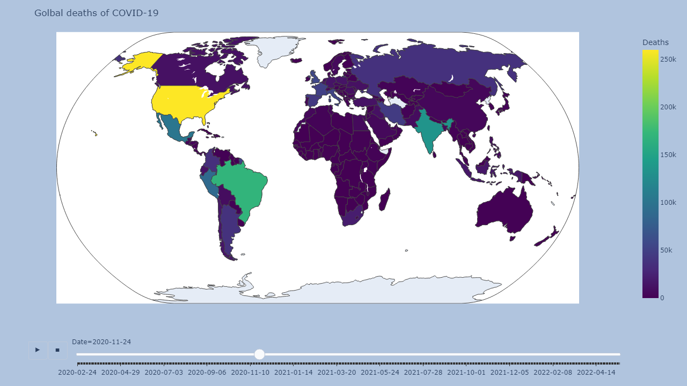
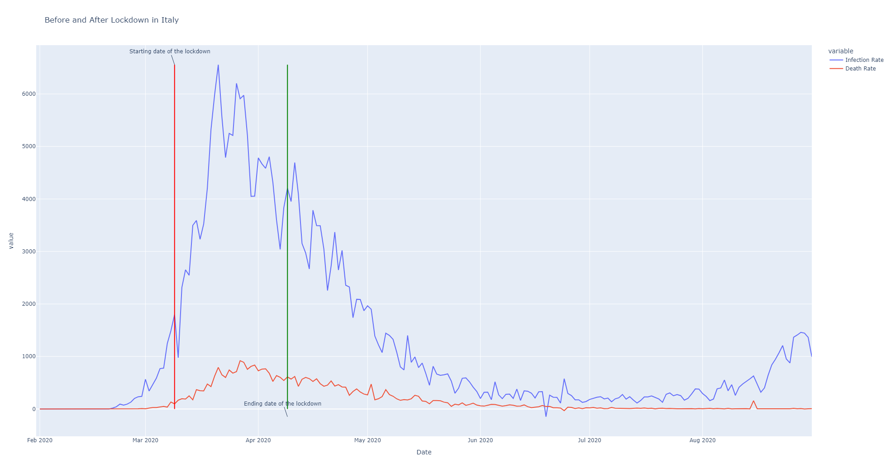

# Case Study - Covid19 Data Analysis

### Importing modules


```python
import pandas as pd
import numpy as np
import plotly.express as px
import matplotlib.pyplot as plt 
%matplotlib inline

import warnings
warnings.filterwarnings('ignore')

print('Modules are imported')
```

    Modules are imported
    

#### Loading the Dataset


```python
dataset_url = 'https://raw.githubusercontent.com/datasets/covid-19/master/data/countries-aggregated.csv'
df = pd.read_csv(dataset_url)
```

#### Checking the dataframe 


```python
df.head()
```


<div>

<table border="1" class="dataframe">
  <thead>
    <tr style="text-align: right;">
      <th></th>
      <th>Date</th>
      <th>Country</th>
      <th>Confirmed</th>
      <th>Recovered</th>
      <th>Deaths</th>
    </tr>
  </thead>
  <tbody>
    <tr>
      <th>0</th>
      <td>2020-01-22</td>
      <td>Afghanistan</td>
      <td>0</td>
      <td>0</td>
      <td>0</td>
    </tr>
    <tr>
      <th>1</th>
      <td>2020-01-23</td>
      <td>Afghanistan</td>
      <td>0</td>
      <td>0</td>
      <td>0</td>
    </tr>
    <tr>
      <th>2</th>
      <td>2020-01-24</td>
      <td>Afghanistan</td>
      <td>0</td>
      <td>0</td>
      <td>0</td>
    </tr>
    <tr>
      <th>3</th>
      <td>2020-01-25</td>
      <td>Afghanistan</td>
      <td>0</td>
      <td>0</td>
      <td>0</td>
    </tr>
    <tr>
      <th>4</th>
      <td>2020-01-26</td>
      <td>Afghanistan</td>
      <td>0</td>
      <td>0</td>
      <td>0</td>
    </tr>
  </tbody>
</table>
</div>


```python
df.tail()
```


<div>

<table border="1" class="dataframe">
  <thead>
    <tr style="text-align: right;">
      <th></th>
      <th>Date</th>
      <th>Country</th>
      <th>Confirmed</th>
      <th>Recovered</th>
      <th>Deaths</th>
    </tr>
  </thead>
  <tbody>
    <tr>
      <th>161563</th>
      <td>2022-04-12</td>
      <td>Zimbabwe</td>
      <td>247094</td>
      <td>0</td>
      <td>5460</td>
    </tr>
    <tr>
      <th>161564</th>
      <td>2022-04-13</td>
      <td>Zimbabwe</td>
      <td>247160</td>
      <td>0</td>
      <td>5460</td>
    </tr>
    <tr>
      <th>161565</th>
      <td>2022-04-14</td>
      <td>Zimbabwe</td>
      <td>247208</td>
      <td>0</td>
      <td>5462</td>
    </tr>
    <tr>
      <th>161566</th>
      <td>2022-04-15</td>
      <td>Zimbabwe</td>
      <td>247237</td>
      <td>0</td>
      <td>5462</td>
    </tr>
    <tr>
      <th>161567</th>
      <td>2022-04-16</td>
      <td>Zimbabwe</td>
      <td>247237</td>
      <td>0</td>
      <td>5462</td>
    </tr>
  </tbody>
</table>
</div>


```python
df.shape
```


    (161568, 5)


#### Data Manipulation


```python
df = df[df['Confirmed'] > 0]
```


```python
df
```


<div>

<table border="1" class="dataframe">
  <thead>
    <tr style="text-align: right;">
      <th></th>
      <th>Date</th>
      <th>Country</th>
      <th>Confirmed</th>
      <th>Recovered</th>
      <th>Deaths</th>
    </tr>
  </thead>
  <tbody>
    <tr>
      <th>33</th>
      <td>2020-02-24</td>
      <td>Afghanistan</td>
      <td>5</td>
      <td>0</td>
      <td>0</td>
    </tr>
    <tr>
      <th>34</th>
      <td>2020-02-25</td>
      <td>Afghanistan</td>
      <td>5</td>
      <td>0</td>
      <td>0</td>
    </tr>
    <tr>
      <th>35</th>
      <td>2020-02-26</td>
      <td>Afghanistan</td>
      <td>5</td>
      <td>0</td>
      <td>0</td>
    </tr>
    <tr>
      <th>36</th>
      <td>2020-02-27</td>
      <td>Afghanistan</td>
      <td>5</td>
      <td>0</td>
      <td>0</td>
    </tr>
    <tr>
      <th>37</th>
      <td>2020-02-28</td>
      <td>Afghanistan</td>
      <td>5</td>
      <td>0</td>
      <td>0</td>
    </tr>
    <tr>
      <th>...</th>
      <td>...</td>
      <td>...</td>
      <td>...</td>
      <td>...</td>
      <td>...</td>
    </tr>
    <tr>
      <th>161563</th>
      <td>2022-04-12</td>
      <td>Zimbabwe</td>
      <td>247094</td>
      <td>0</td>
      <td>5460</td>
    </tr>
    <tr>
      <th>161564</th>
      <td>2022-04-13</td>
      <td>Zimbabwe</td>
      <td>247160</td>
      <td>0</td>
      <td>5460</td>
    </tr>
    <tr>
      <th>161565</th>
      <td>2022-04-14</td>
      <td>Zimbabwe</td>
      <td>247208</td>
      <td>0</td>
      <td>5462</td>
    </tr>
    <tr>
      <th>161566</th>
      <td>2022-04-15</td>
      <td>Zimbabwe</td>
      <td>247237</td>
      <td>0</td>
      <td>5462</td>
    </tr>
    <tr>
      <th>161567</th>
      <td>2022-04-16</td>
      <td>Zimbabwe</td>
      <td>247237</td>
      <td>0</td>
      <td>5462</td>
    </tr>
  </tbody>
</table>
<p>148455 rows × 5 columns</p>
</div>


#### let's see data related to a country for example Australia 


```python
df[df.Country == 'Australia']
```


<div>

<table border="1" class="dataframe">
  <thead>
    <tr style="text-align: right;">
      <th></th>
      <th>Date</th>
      <th>Country</th>
      <th>Confirmed</th>
      <th>Recovered</th>
      <th>Deaths</th>
    </tr>
  </thead>
  <tbody>
    <tr>
      <th>7348</th>
      <td>2020-01-26</td>
      <td>Australia</td>
      <td>4</td>
      <td>0</td>
      <td>0</td>
    </tr>
    <tr>
      <th>7349</th>
      <td>2020-01-27</td>
      <td>Australia</td>
      <td>5</td>
      <td>0</td>
      <td>0</td>
    </tr>
    <tr>
      <th>7350</th>
      <td>2020-01-28</td>
      <td>Australia</td>
      <td>5</td>
      <td>0</td>
      <td>0</td>
    </tr>
    <tr>
      <th>7351</th>
      <td>2020-01-29</td>
      <td>Australia</td>
      <td>6</td>
      <td>0</td>
      <td>0</td>
    </tr>
    <tr>
      <th>7352</th>
      <td>2020-01-30</td>
      <td>Australia</td>
      <td>9</td>
      <td>2</td>
      <td>0</td>
    </tr>
    <tr>
      <th>...</th>
      <td>...</td>
      <td>...</td>
      <td>...</td>
      <td>...</td>
      <td>...</td>
    </tr>
    <tr>
      <th>8155</th>
      <td>2022-04-12</td>
      <td>Australia</td>
      <td>5207650</td>
      <td>0</td>
      <td>6648</td>
    </tr>
    <tr>
      <th>8156</th>
      <td>2022-04-13</td>
      <td>Australia</td>
      <td>5262359</td>
      <td>0</td>
      <td>6693</td>
    </tr>
    <tr>
      <th>8157</th>
      <td>2022-04-14</td>
      <td>Australia</td>
      <td>5308858</td>
      <td>0</td>
      <td>6727</td>
    </tr>
    <tr>
      <th>8158</th>
      <td>2022-04-15</td>
      <td>Australia</td>
      <td>5345438</td>
      <td>0</td>
      <td>6755</td>
    </tr>
    <tr>
      <th>8159</th>
      <td>2022-04-16</td>
      <td>Australia</td>
      <td>5384615</td>
      <td>0</td>
      <td>6779</td>
    </tr>
  </tbody>
</table>
<p>812 rows × 5 columns</p>
</div>


#### Global spread of Covid19


```python
fig = px.choropleth(df, locations= "Country", locationmode= "country names", color= "Confirmed", 
                    animation_frame= 'Date', color_continuous_scale='Viridis', projection='natural earth')
fig.update_layout(
    margin=dict(l=20, r=20, b=20),
    paper_bgcolor="LightSteelBlue",
    width=1280, height=720,
    title_text = 'Global spread of COVID-19'
)
fig.show()
```


    

    


#### Global deaths of Covid19


```python
fig = px.choropleth(df, locations= "Country", locationmode= "country names", color= "Deaths", 
                    animation_frame= 'Date', color_continuous_scale='Viridis', projection='natural earth')
fig.update_layout(
    margin=dict(l=20, r=20, b=20),
    paper_bgcolor="LightSteelBlue",
    width=1280, height=720,
    title_text = 'Golbal deaths of COVID-19'
)
fig.show()

```


    

    


#### Let's Visualize how intensive the Covid19 Transmission has been in Australia over time using Infection rate


```python
df_australia = df[df.Country == 'Australia']
df_australia
```


<div>

<table border="1" class="dataframe">
  <thead>
    <tr style="text-align: right;">
      <th></th>
      <th>Date</th>
      <th>Country</th>
      <th>Confirmed</th>
      <th>Recovered</th>
      <th>Deaths</th>
    </tr>
  </thead>
  <tbody>
    <tr>
      <th>7348</th>
      <td>2020-01-26</td>
      <td>Australia</td>
      <td>4</td>
      <td>0</td>
      <td>0</td>
    </tr>
    <tr>
      <th>7349</th>
      <td>2020-01-27</td>
      <td>Australia</td>
      <td>5</td>
      <td>0</td>
      <td>0</td>
    </tr>
    <tr>
      <th>7350</th>
      <td>2020-01-28</td>
      <td>Australia</td>
      <td>5</td>
      <td>0</td>
      <td>0</td>
    </tr>
    <tr>
      <th>7351</th>
      <td>2020-01-29</td>
      <td>Australia</td>
      <td>6</td>
      <td>0</td>
      <td>0</td>
    </tr>
    <tr>
      <th>7352</th>
      <td>2020-01-30</td>
      <td>Australia</td>
      <td>9</td>
      <td>2</td>
      <td>0</td>
    </tr>
    <tr>
      <th>...</th>
      <td>...</td>
      <td>...</td>
      <td>...</td>
      <td>...</td>
      <td>...</td>
    </tr>
    <tr>
      <th>8155</th>
      <td>2022-04-12</td>
      <td>Australia</td>
      <td>5207650</td>
      <td>0</td>
      <td>6648</td>
    </tr>
    <tr>
      <th>8156</th>
      <td>2022-04-13</td>
      <td>Australia</td>
      <td>5262359</td>
      <td>0</td>
      <td>6693</td>
    </tr>
    <tr>
      <th>8157</th>
      <td>2022-04-14</td>
      <td>Australia</td>
      <td>5308858</td>
      <td>0</td>
      <td>6727</td>
    </tr>
    <tr>
      <th>8158</th>
      <td>2022-04-15</td>
      <td>Australia</td>
      <td>5345438</td>
      <td>0</td>
      <td>6755</td>
    </tr>
    <tr>
      <th>8159</th>
      <td>2022-04-16</td>
      <td>Australia</td>
      <td>5384615</td>
      <td>0</td>
      <td>6779</td>
    </tr>
  </tbody>
</table>
<p>812 rows × 5 columns</p>
</div>


let's select the columns that we need


```python
df_australia = df_australia[['Date', 'Confirmed']]
```


```python
df_australia
```


<div>

<table border="1" class="dataframe">
  <thead>
    <tr style="text-align: right;">
      <th></th>
      <th>Date</th>
      <th>Confirmed</th>
    </tr>
  </thead>
  <tbody>
    <tr>
      <th>7348</th>
      <td>2020-01-26</td>
      <td>4</td>
    </tr>
    <tr>
      <th>7349</th>
      <td>2020-01-27</td>
      <td>5</td>
    </tr>
    <tr>
      <th>7350</th>
      <td>2020-01-28</td>
      <td>5</td>
    </tr>
    <tr>
      <th>7351</th>
      <td>2020-01-29</td>
      <td>6</td>
    </tr>
    <tr>
      <th>7352</th>
      <td>2020-01-30</td>
      <td>9</td>
    </tr>
    <tr>
      <th>...</th>
      <td>...</td>
      <td>...</td>
    </tr>
    <tr>
      <th>8155</th>
      <td>2022-04-12</td>
      <td>5207650</td>
    </tr>
    <tr>
      <th>8156</th>
      <td>2022-04-13</td>
      <td>5262359</td>
    </tr>
    <tr>
      <th>8157</th>
      <td>2022-04-14</td>
      <td>5308858</td>
    </tr>
    <tr>
      <th>8158</th>
      <td>2022-04-15</td>
      <td>5345438</td>
    </tr>
    <tr>
      <th>8159</th>
      <td>2022-04-16</td>
      <td>5384615</td>
    </tr>
  </tbody>
</table>
<p>812 rows × 2 columns</p>
</div>


calculating the first derivation of confrimed column


```python
df_australia.loc[:, 'Infection Rate'] = df_australia['Confirmed'].diff()
```


```python
df_australia
```


<div>

<table border="1" class="dataframe">
  <thead>
    <tr style="text-align: right;">
      <th></th>
      <th>Date</th>
      <th>Confirmed</th>
      <th>Infection Rate</th>
    </tr>
  </thead>
  <tbody>
    <tr>
      <th>7348</th>
      <td>2020-01-26</td>
      <td>4</td>
      <td>NaN</td>
    </tr>
    <tr>
      <th>7349</th>
      <td>2020-01-27</td>
      <td>5</td>
      <td>1.0</td>
    </tr>
    <tr>
      <th>7350</th>
      <td>2020-01-28</td>
      <td>5</td>
      <td>0.0</td>
    </tr>
    <tr>
      <th>7351</th>
      <td>2020-01-29</td>
      <td>6</td>
      <td>1.0</td>
    </tr>
    <tr>
      <th>7352</th>
      <td>2020-01-30</td>
      <td>9</td>
      <td>3.0</td>
    </tr>
    <tr>
      <th>...</th>
      <td>...</td>
      <td>...</td>
      <td>...</td>
    </tr>
    <tr>
      <th>8155</th>
      <td>2022-04-12</td>
      <td>5207650</td>
      <td>53017.0</td>
    </tr>
    <tr>
      <th>8156</th>
      <td>2022-04-13</td>
      <td>5262359</td>
      <td>54709.0</td>
    </tr>
    <tr>
      <th>8157</th>
      <td>2022-04-14</td>
      <td>5308858</td>
      <td>46499.0</td>
    </tr>
    <tr>
      <th>8158</th>
      <td>2022-04-15</td>
      <td>5345438</td>
      <td>36580.0</td>
    </tr>
    <tr>
      <th>8159</th>
      <td>2022-04-16</td>
      <td>5384615</td>
      <td>39177.0</td>
    </tr>
  </tbody>
</table>
<p>812 rows × 3 columns</p>
</div>


```python
px.line(df_australia, x= 'Date', y = ['Confirmed', 'Infection Rate'])
```


```python
df_australia['Infection Rate'].max()
```


    np.float64(175271.0)


Maximum infection rate for all of the countries


```python
df.head()
```


<div>

<table border="1" class="dataframe">
  <thead>
    <tr style="text-align: right;">
      <th></th>
      <th>Date</th>
      <th>Country</th>
      <th>Confirmed</th>
      <th>Recovered</th>
      <th>Deaths</th>
    </tr>
  </thead>
  <tbody>
    <tr>
      <th>33</th>
      <td>2020-02-24</td>
      <td>Afghanistan</td>
      <td>5</td>
      <td>0</td>
      <td>0</td>
    </tr>
    <tr>
      <th>34</th>
      <td>2020-02-25</td>
      <td>Afghanistan</td>
      <td>5</td>
      <td>0</td>
      <td>0</td>
    </tr>
    <tr>
      <th>35</th>
      <td>2020-02-26</td>
      <td>Afghanistan</td>
      <td>5</td>
      <td>0</td>
      <td>0</td>
    </tr>
    <tr>
      <th>36</th>
      <td>2020-02-27</td>
      <td>Afghanistan</td>
      <td>5</td>
      <td>0</td>
      <td>0</td>
    </tr>
    <tr>
      <th>37</th>
      <td>2020-02-28</td>
      <td>Afghanistan</td>
      <td>5</td>
      <td>0</td>
      <td>0</td>
    </tr>
  </tbody>
</table>
</div>


```python
countries = list(df['Country'].unique())
max_infection_rate = []
for c in countries:
    MIR = df[df.Country == c].Confirmed.diff().max()
    max_infection_rate.append(MIR)
```


```python
df_MIR = pd.DataFrame()
df_MIR['Country'] = countries
df_MIR['Max Infection Rate'] = max_infection_rate
df_MIR = df_MIR.sort_values(by=['Max Infection Rate'], ascending=False)
df_MIR
```


<div>

<table border="1" class="dataframe">
  <thead>
    <tr style="text-align: right;">
      <th></th>
      <th>Country</th>
      <th>Max Infection Rate</th>
    </tr>
  </thead>
  <tbody>
    <tr>
      <th>183</th>
      <td>US</td>
      <td>1383795.0</td>
    </tr>
    <tr>
      <th>187</th>
      <td>United Kingdom</td>
      <td>848169.0</td>
    </tr>
    <tr>
      <th>182</th>
      <td>Turkey</td>
      <td>823225.0</td>
    </tr>
    <tr>
      <th>93</th>
      <td>Korea, South</td>
      <td>621317.0</td>
    </tr>
    <tr>
      <th>67</th>
      <td>Germany</td>
      <td>527487.0</td>
    </tr>
    <tr>
      <th>...</th>
      <td>...</td>
      <td>...</td>
    </tr>
    <tr>
      <th>106</th>
      <td>MS Zaandam</td>
      <td>7.0</td>
    </tr>
    <tr>
      <th>76</th>
      <td>Holy See</td>
      <td>7.0</td>
    </tr>
    <tr>
      <th>113</th>
      <td>Marshall Islands</td>
      <td>3.0</td>
    </tr>
    <tr>
      <th>5</th>
      <td>Antarctica</td>
      <td>0.0</td>
    </tr>
    <tr>
      <th>117</th>
      <td>Micronesia</td>
      <td>0.0</td>
    </tr>
  </tbody>
</table>
<p>198 rows × 2 columns</p>
</div>


#### Let's plot the barchart : Maximum infection rate of each country


```python
fig = px.bar(df_MIR, x = 'Country', y= 'Max Infection Rate', color= 'Country', title= 'Global maximum infection rate', log_y= True)
fig.update_layout(width=1920, height = 720)
fig.show()
```


**Global Maximum Infection Rate**

- Description: The chart displays the maximum infection rate for various countries.
- Insights:
	- The U.S. has the highest maximum infection rate, followed by the United Kingdom, Turkey, and South Korea.
	- The infection rates are plotted on a logarithmic scale, which helps in visualizing the differences across a wide range of values.
	- There is a significant drop in the maximum infection rate as we move from the countries with the highest rates to those with the lowest rates.

### COVID19 pandemic lockdown in Italy 
On 9 March 2020, the government of Italy under Prime Minister Giuseppe Conte imposed a national quarantine, restricting the movement of the population except for necessity, work, and health circumstances, in response to the growing pandemic of COVID-19 in the country. <a href="https://en.wikipedia.org/wiki/COVID-19_pandemic_lockdown_in_Italy#:~:text=On%209%20March%202020%2C%20the,COVID%2D19%20in%20the%20country.">source</a>


```python
italy_lockdown_start_date = '2020-03-09'
italy_lockdown_a_month_later = '2020-04-09'
```


```python
df.head()
```


<div>

<table border="1" class="dataframe">
  <thead>
    <tr style="text-align: right;">
      <th></th>
      <th>Date</th>
      <th>Country</th>
      <th>Confirmed</th>
      <th>Recovered</th>
      <th>Deaths</th>
    </tr>
  </thead>
  <tbody>
    <tr>
      <th>33</th>
      <td>2020-02-24</td>
      <td>Afghanistan</td>
      <td>5</td>
      <td>0</td>
      <td>0</td>
    </tr>
    <tr>
      <th>34</th>
      <td>2020-02-25</td>
      <td>Afghanistan</td>
      <td>5</td>
      <td>0</td>
      <td>0</td>
    </tr>
    <tr>
      <th>35</th>
      <td>2020-02-26</td>
      <td>Afghanistan</td>
      <td>5</td>
      <td>0</td>
      <td>0</td>
    </tr>
    <tr>
      <th>36</th>
      <td>2020-02-27</td>
      <td>Afghanistan</td>
      <td>5</td>
      <td>0</td>
      <td>0</td>
    </tr>
    <tr>
      <th>37</th>
      <td>2020-02-28</td>
      <td>Afghanistan</td>
      <td>5</td>
      <td>0</td>
      <td>0</td>
    </tr>
  </tbody>
</table>
</div>


let's get data related to italy


```python
df_italy = df[(df['Country'] == 'Italy') & (df['Date'] < '2020-09-01')]
```

lets check the dataframe


```python
df_italy
```


<div>

<table border="1" class="dataframe">
  <thead>
    <tr style="text-align: right;">
      <th></th>
      <th>Date</th>
      <th>Country</th>
      <th>Confirmed</th>
      <th>Recovered</th>
      <th>Deaths</th>
    </tr>
  </thead>
  <tbody>
    <tr>
      <th>70185</th>
      <td>2020-01-31</td>
      <td>Italy</td>
      <td>2</td>
      <td>0</td>
      <td>0</td>
    </tr>
    <tr>
      <th>70186</th>
      <td>2020-02-01</td>
      <td>Italy</td>
      <td>2</td>
      <td>0</td>
      <td>0</td>
    </tr>
    <tr>
      <th>70187</th>
      <td>2020-02-02</td>
      <td>Italy</td>
      <td>2</td>
      <td>0</td>
      <td>0</td>
    </tr>
    <tr>
      <th>70188</th>
      <td>2020-02-03</td>
      <td>Italy</td>
      <td>2</td>
      <td>0</td>
      <td>0</td>
    </tr>
    <tr>
      <th>70189</th>
      <td>2020-02-04</td>
      <td>Italy</td>
      <td>2</td>
      <td>0</td>
      <td>0</td>
    </tr>
    <tr>
      <th>...</th>
      <td>...</td>
      <td>...</td>
      <td>...</td>
      <td>...</td>
      <td>...</td>
    </tr>
    <tr>
      <th>70394</th>
      <td>2020-08-27</td>
      <td>Italy</td>
      <td>263949</td>
      <td>206554</td>
      <td>35463</td>
    </tr>
    <tr>
      <th>70395</th>
      <td>2020-08-28</td>
      <td>Italy</td>
      <td>265409</td>
      <td>206902</td>
      <td>35472</td>
    </tr>
    <tr>
      <th>70396</th>
      <td>2020-08-29</td>
      <td>Italy</td>
      <td>266853</td>
      <td>208224</td>
      <td>35473</td>
    </tr>
    <tr>
      <th>70397</th>
      <td>2020-08-30</td>
      <td>Italy</td>
      <td>268218</td>
      <td>208536</td>
      <td>35477</td>
    </tr>
    <tr>
      <th>70398</th>
      <td>2020-08-31</td>
      <td>Italy</td>
      <td>269214</td>
      <td>207653</td>
      <td>35483</td>
    </tr>
  </tbody>
</table>
<p>214 rows × 5 columns</p>
</div>


let's calculate the infection rate in Italy


```python
df_italy.loc[:, 'Infection Rate'] = df_italy.Confirmed.diff()
df_italy.loc[:, 'Death Rate'] = df_italy.Deaths.diff()
df_italy
```


<div>

<table border="1" class="dataframe">
  <thead>
    <tr style="text-align: right;">
      <th></th>
      <th>Date</th>
      <th>Country</th>
      <th>Confirmed</th>
      <th>Recovered</th>
      <th>Deaths</th>
      <th>Infection Rate</th>
      <th>Death Rate</th>
    </tr>
  </thead>
  <tbody>
    <tr>
      <th>70185</th>
      <td>2020-01-31</td>
      <td>Italy</td>
      <td>2</td>
      <td>0</td>
      <td>0</td>
      <td>NaN</td>
      <td>NaN</td>
    </tr>
    <tr>
      <th>70186</th>
      <td>2020-02-01</td>
      <td>Italy</td>
      <td>2</td>
      <td>0</td>
      <td>0</td>
      <td>0.0</td>
      <td>0.0</td>
    </tr>
    <tr>
      <th>70187</th>
      <td>2020-02-02</td>
      <td>Italy</td>
      <td>2</td>
      <td>0</td>
      <td>0</td>
      <td>0.0</td>
      <td>0.0</td>
    </tr>
    <tr>
      <th>70188</th>
      <td>2020-02-03</td>
      <td>Italy</td>
      <td>2</td>
      <td>0</td>
      <td>0</td>
      <td>0.0</td>
      <td>0.0</td>
    </tr>
    <tr>
      <th>70189</th>
      <td>2020-02-04</td>
      <td>Italy</td>
      <td>2</td>
      <td>0</td>
      <td>0</td>
      <td>0.0</td>
      <td>0.0</td>
    </tr>
    <tr>
      <th>...</th>
      <td>...</td>
      <td>...</td>
      <td>...</td>
      <td>...</td>
      <td>...</td>
      <td>...</td>
      <td>...</td>
    </tr>
    <tr>
      <th>70394</th>
      <td>2020-08-27</td>
      <td>Italy</td>
      <td>263949</td>
      <td>206554</td>
      <td>35463</td>
      <td>1409.0</td>
      <td>5.0</td>
    </tr>
    <tr>
      <th>70395</th>
      <td>2020-08-28</td>
      <td>Italy</td>
      <td>265409</td>
      <td>206902</td>
      <td>35472</td>
      <td>1460.0</td>
      <td>9.0</td>
    </tr>
    <tr>
      <th>70396</th>
      <td>2020-08-29</td>
      <td>Italy</td>
      <td>266853</td>
      <td>208224</td>
      <td>35473</td>
      <td>1444.0</td>
      <td>1.0</td>
    </tr>
    <tr>
      <th>70397</th>
      <td>2020-08-30</td>
      <td>Italy</td>
      <td>268218</td>
      <td>208536</td>
      <td>35477</td>
      <td>1365.0</td>
      <td>4.0</td>
    </tr>
    <tr>
      <th>70398</th>
      <td>2020-08-31</td>
      <td>Italy</td>
      <td>269214</td>
      <td>207653</td>
      <td>35483</td>
      <td>996.0</td>
      <td>6.0</td>
    </tr>
  </tbody>
</table>
<p>214 rows × 7 columns</p>
</div>


ok! now let's do the visualization


```python
fig= px.line(df_italy, x = 'Date', y= ['Infection Rate', "Death Rate"], title= 'Before and After Lockdown in Italy')
fig.add_shape(
    dict(
        type = 'line',
        x0 = italy_lockdown_start_date,
        y0 = 0,
        x1 = italy_lockdown_start_date,
        y1= df_italy['Infection Rate'].max(),
        line = dict(color = 'red', width=2)       
    )
)
fig.add_annotation(
    dict(
        x = italy_lockdown_start_date,
        y = df_italy['Infection Rate'].max(),
        text = 'Starting date of the lockdown'
    )
)
fig.add_shape(
    dict(
        type = 'line',
        x0 = italy_lockdown_a_month_later,
        y0 = 0,
        x1 = italy_lockdown_a_month_later,
        y1= df_italy['Infection Rate'].max(),
        line = dict(color = 'green', width=2)       
    )
)
fig.add_annotation(
    dict(
        x = italy_lockdown_a_month_later,
        y = df_italy['Infection Rate'].min(),
        text = 'Ending date of the lockdown'
    )
)
fig.show()
```




### COVID19 pandemic lockdown in Germany 
Lockdown was started in Freiburg, Baden-Württemberg and Bavaria on 20 March 2020. Three days later, it was expanded to the whole of Germany


```python
Germany_lockdown_start_date = '2020-03-23' 
Germany_lockdown_a_month_later = '2020-04-23'
```

let's select the data related to Germany


```python
df_germany = df[(df["Country"] == 'Germany') & (df['Date'] < '2020-09-01')]
```

let's check the dataframe 


```python
df_germany
```


<div>

<table border="1" class="dataframe">
  <thead>
    <tr style="text-align: right;">
      <th></th>
      <th>Date</th>
      <th>Country</th>
      <th>Confirmed</th>
      <th>Recovered</th>
      <th>Deaths</th>
    </tr>
  </thead>
  <tbody>
    <tr>
      <th>54677</th>
      <td>2020-01-27</td>
      <td>Germany</td>
      <td>1</td>
      <td>0</td>
      <td>0</td>
    </tr>
    <tr>
      <th>54678</th>
      <td>2020-01-28</td>
      <td>Germany</td>
      <td>4</td>
      <td>0</td>
      <td>0</td>
    </tr>
    <tr>
      <th>54679</th>
      <td>2020-01-29</td>
      <td>Germany</td>
      <td>4</td>
      <td>0</td>
      <td>0</td>
    </tr>
    <tr>
      <th>54680</th>
      <td>2020-01-30</td>
      <td>Germany</td>
      <td>4</td>
      <td>0</td>
      <td>0</td>
    </tr>
    <tr>
      <th>54681</th>
      <td>2020-01-31</td>
      <td>Germany</td>
      <td>5</td>
      <td>0</td>
      <td>0</td>
    </tr>
    <tr>
      <th>...</th>
      <td>...</td>
      <td>...</td>
      <td>...</td>
      <td>...</td>
      <td>...</td>
    </tr>
    <tr>
      <th>54890</th>
      <td>2020-08-27</td>
      <td>Germany</td>
      <td>237936</td>
      <td>212909</td>
      <td>9285</td>
    </tr>
    <tr>
      <th>54891</th>
      <td>2020-08-28</td>
      <td>Germany</td>
      <td>239507</td>
      <td>214186</td>
      <td>9288</td>
    </tr>
    <tr>
      <th>54892</th>
      <td>2020-08-29</td>
      <td>Germany</td>
      <td>240986</td>
      <td>214790</td>
      <td>9289</td>
    </tr>
    <tr>
      <th>54893</th>
      <td>2020-08-30</td>
      <td>Germany</td>
      <td>241771</td>
      <td>215283</td>
      <td>9295</td>
    </tr>
    <tr>
      <th>54894</th>
      <td>2020-08-31</td>
      <td>Germany</td>
      <td>242381</td>
      <td>216795</td>
      <td>9298</td>
    </tr>
  </tbody>
</table>
<p>218 rows × 5 columns</p>
</div>


selecting the needed column


```python
df_germany.loc[:, 'Infection Rate'] = df_germany.Confirmed.diff()
df_germany.loc[:, 'Death Rate'] = df_germany.Deaths.diff()

```

let's check the dataframe


```python
df_germany
```


<div>

<table border="1" class="dataframe">
  <thead>
    <tr style="text-align: right;">
      <th></th>
      <th>Date</th>
      <th>Country</th>
      <th>Confirmed</th>
      <th>Recovered</th>
      <th>Deaths</th>
      <th>Infection Rate</th>
      <th>Death Rate</th>
    </tr>
  </thead>
  <tbody>
    <tr>
      <th>54677</th>
      <td>2020-01-27</td>
      <td>Germany</td>
      <td>1</td>
      <td>0</td>
      <td>0</td>
      <td>NaN</td>
      <td>NaN</td>
    </tr>
    <tr>
      <th>54678</th>
      <td>2020-01-28</td>
      <td>Germany</td>
      <td>4</td>
      <td>0</td>
      <td>0</td>
      <td>3.0</td>
      <td>0.0</td>
    </tr>
    <tr>
      <th>54679</th>
      <td>2020-01-29</td>
      <td>Germany</td>
      <td>4</td>
      <td>0</td>
      <td>0</td>
      <td>0.0</td>
      <td>0.0</td>
    </tr>
    <tr>
      <th>54680</th>
      <td>2020-01-30</td>
      <td>Germany</td>
      <td>4</td>
      <td>0</td>
      <td>0</td>
      <td>0.0</td>
      <td>0.0</td>
    </tr>
    <tr>
      <th>54681</th>
      <td>2020-01-31</td>
      <td>Germany</td>
      <td>5</td>
      <td>0</td>
      <td>0</td>
      <td>1.0</td>
      <td>0.0</td>
    </tr>
    <tr>
      <th>...</th>
      <td>...</td>
      <td>...</td>
      <td>...</td>
      <td>...</td>
      <td>...</td>
      <td>...</td>
      <td>...</td>
    </tr>
    <tr>
      <th>54890</th>
      <td>2020-08-27</td>
      <td>Germany</td>
      <td>237936</td>
      <td>212909</td>
      <td>9285</td>
      <td>1507.0</td>
      <td>5.0</td>
    </tr>
    <tr>
      <th>54891</th>
      <td>2020-08-28</td>
      <td>Germany</td>
      <td>239507</td>
      <td>214186</td>
      <td>9288</td>
      <td>1571.0</td>
      <td>3.0</td>
    </tr>
    <tr>
      <th>54892</th>
      <td>2020-08-29</td>
      <td>Germany</td>
      <td>240986</td>
      <td>214790</td>
      <td>9289</td>
      <td>1479.0</td>
      <td>1.0</td>
    </tr>
    <tr>
      <th>54893</th>
      <td>2020-08-30</td>
      <td>Germany</td>
      <td>241771</td>
      <td>215283</td>
      <td>9295</td>
      <td>785.0</td>
      <td>6.0</td>
    </tr>
    <tr>
      <th>54894</th>
      <td>2020-08-31</td>
      <td>Germany</td>
      <td>242381</td>
      <td>216795</td>
      <td>9298</td>
      <td>610.0</td>
      <td>3.0</td>
    </tr>
  </tbody>
</table>
<p>218 rows × 7 columns</p>
</div>


now let's plot the line chart


```python
fig= px.line(df_germany, x = 'Date', y= ['Infection Rate', 'Death Rate'], title= 'Before and After Lockdown in Germany')
fig.add_shape(
    dict(
        type = 'line',
        x0 = Germany_lockdown_start_date,
        y0 = 0,
        x1 = Germany_lockdown_start_date,
        y1= df_germany['Infection Rate'].max(),
        line = dict(color = 'red', width=2)       
    )
)
fig.add_annotation(
    dict(
        x = Germany_lockdown_start_date,
        y = df_germany['Infection Rate'].max(),
        text = 'Starting date of the lockdown'
    )
)
fig.add_shape(
    dict(
        type = 'line',
        x0 = Germany_lockdown_a_month_later,
        y0 = 0,
        x1 = Germany_lockdown_a_month_later,
        y1= df_germany['Infection Rate'].max(),
        line = dict(color = 'green', width=2)       
    )
)
fig.add_annotation(
    dict(
        x = Germany_lockdown_a_month_later,
        y = df_germany['Infection Rate'].min(),
        text = 'Ending date of the lockdown'
    )
)
fig.show()
```


